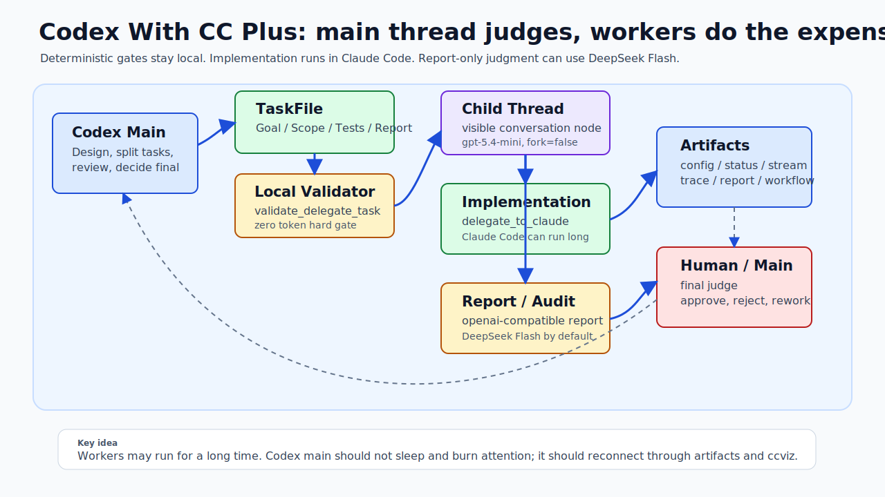
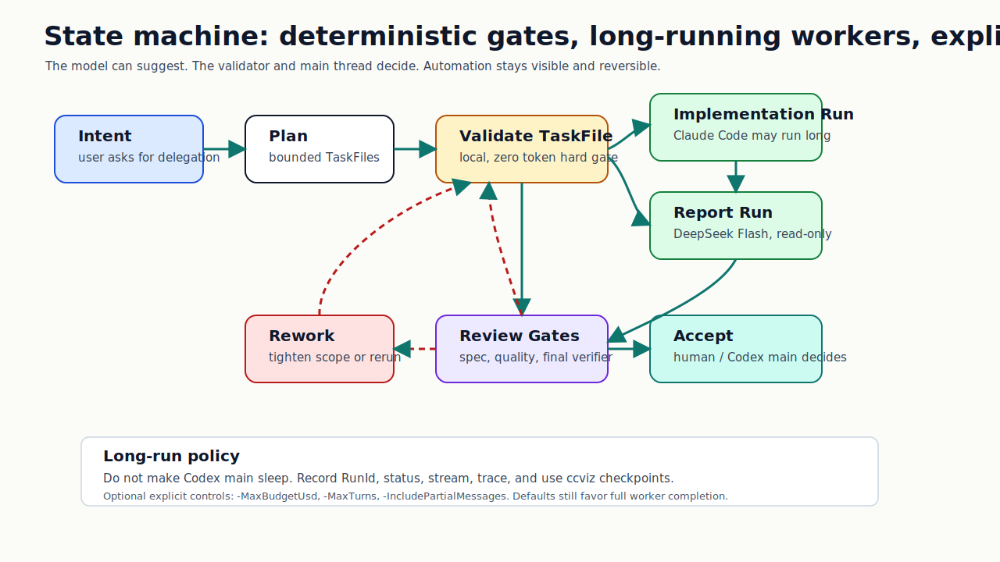

# Codex With CC Plus

中文 | [English](README_EN.MD)

Codex With CC Plus 是一套面向 Codex 的可审计多 worker 工作流：Codex 主线程负责拆解、派工、验收和最终判断；昂贵、耗时、需要改代码的实现任务交给 Claude Code；便宜、高频、只读的报告和审计任务交给 DeepSeek、MiniMax、MiMo 或其他 OpenAI-compatible API。

如果你是 Codex，并且用户要求安装或更新这个工作流，请先阅读 [AI_INSTALL.md](AI_INSTALL.md)。

## 模型价格速览

价格会变化。下表只作为 2026-06-03 的架构选型参考；最终账单和精确 API model id 请以各平台官网为准。

| 服务商 | 模型 / 档位 | 上下文说明 | 输入缓存命中 / 百万 token | 输入缓存未命中 / 百万 token | 输出 / 百万 token | 官方链接 |
| --- | --- | --- | ---: | ---: | ---: | --- |
| DeepSeek | `deepseek-chat` | 64K 上下文，最大 8K 输出 | $0.07 | $0.27 | $1.10 | [DeepSeek pricing](https://api-docs.deepseek.com/quick_start/pricing-details-usd) |
| DeepSeek | `deepseek-reasoner` | 64K 上下文，最大 32K CoT，最大 8K 输出 | $0.14 | $0.55 | $2.19 | [DeepSeek pricing](https://api-docs.deepseek.com/quick_start/pricing-details-usd) |
| MiniMax | `MiniMax-M3` 标准档，输入不超过 512K | 页面列出的 7 天 5 折价格 | $0.06 prompt cache read | $0.30 input | $1.20 | [MiniMax Token Plan](https://platform.minimaxi.com/subscribe/token-plan?code=8Qv3X7oLng&source=link) |
| MiniMax | `MiniMax-M2.7` | 标准 LLM 档位 | $0.06 prompt cache read | $0.30 input | $1.20 | [MiniMax Token Plan](https://platform.minimaxi.com/subscribe/token-plan?code=8Qv3X7oLng&source=link) |
| MiMo | MiMo 2.5 Pro 海外 PAYG | 1M 上下文，最大 128K 输出 | $0.0036 | $0.435 | $0.87 | [MiMo Pay-as-you-go](https://platform.xiaomimimo.com/docs/en-US/price/pay-as-you-go) |
| MiMo | MiMo 2.5 海外 PAYG | 1M 上下文，最大 128K 输出 | $0.0028 | $0.14 | $0.28 | [MiMo Pay-as-you-go](https://platform.xiaomimimo.com/docs/en-US/price/pay-as-you-go) |
| MiMo | MiMo Flash 海外 PAYG | 256K 上下文，最大 64K 输出 | $0.01 | $0.10 | $0.30 | [MiMo Pay-as-you-go](https://platform.xiaomimimo.com/docs/en-US/price/pay-as-you-go) |

这就是 Codex With CC Plus 让人兴奋的地方：它不是把所有事情都塞给一个最贵的大脑硬扛，而是把每一分钱花在正确的位置。便宜模型可以不停做 preflight、归一化、报告审计、失败解释；Claude Code 专心做真正需要动手的实现；Codex 主线程保持清醒，像项目负责人一样看证据、收口、决定是否接受。那种“主线程等到发烫、日志淹死人、worker 写到哪里都不知道”的感觉，会一下子轻很多。





## 它能做什么

Codex With CC Plus 会把一句模糊的“用子代理做”变成一条有状态、有边界、有证据的工作流：

- Codex 主线程规划任务图、定义范围、审查证据，并做最终验收判断。
- TaskFile 把 worker 的意图显式写清楚，包括 `Goal`、`Allowed Scope`、`Forbidden Actions`、`Acceptance Criteria`、`Verification` 和 `Report Requirements`。
- `validate_delegate_task.*` 在派发前作为本地、确定性、零 token 的硬门禁。
- 实现型 worker 通过 `delegate_to_claude.* -> Claude Code CLI` 运行。
- 只读报告型 worker 通过 `delegate_to_openai_compatible_report.* -> DeepSeek Flash / OpenAI-compatible API` 运行。
- 每次运行都会写入 artifacts，包括 `config`、`status`、`prompt`、`stream`、`trace`、`report` 以及工作流聚合 JSON。
- `ccviz` 可以用来检查工作流状态、拓扑、成本、陈旧运行，以及 review / audit 门禁。

核心很简单：让 worker 去做嘈杂的工作，但把责任、证据和最终判断留在 Codex 主线程和人手里。

## 为什么需要它

大型 AI 编码任务常常不是输在模型不聪明，而是输在过程失控：主线程被日志拖进泥里，worker 上下文说不清，并行写入互相踩，review 只信摘要，长实现任务让主线程白白等待。

Codex With CC Plus 给这个过程加上状态机。它不是魔法 prompt，而是一套围绕 TaskFile、child-thread dispatch、确定性验证、artifacts、review gate 和最终验收的小协议。

## 学习关系

本项目学习并参考了原始 `codex-with-cc` / Codex with CC 工作流思想：Codex 做主控，Claude Code 做执行 worker，再用更便宜的模型层承接高频判断。Codex With CC Plus 是一个独立延续，重点放在更严格的 artifacts、OpenAI-compatible report runner、`ccviz` 可观测性，以及 Codex plugin / marketplace 分发。

复用本项目时，请保留 attribution 和 MIT license。

## 平台建议

强烈建议优先在 macOS 使用。

主要开发路径、真实长时间运行 worker 路径、shell wrapper 和运行时自测，都是以 macOS 为主要维护环境。Windows wrapper 作为较薄的兼容入口保留，并且会进行测试，但 Windows 不是推荐的第一优先运行环境。

## 心智模型

```text
Task file format check
-> local validate_delegate_task.*
-> zero-token deterministic hard gate

Implementation task
-> Codex child thread
-> delegate_to_claude.*
-> Claude Code CLI
-> structured report

Report / audit task
-> Codex child thread
-> delegate_to_openai_compatible_report.*
-> DeepSeek Flash or compatible OpenAI API
-> structured report

Final judgment
-> Codex main thread + human
-> verify artifacts, review diffs, accept or rework
```

长时间运行的实现任务应该允许它正常跑完。不要让 Codex 主线程 sleep 并陪跑。记录 `RunId`、`statusPath`、`rawStreamPath` 和 `tracePath`，然后通过 `ccviz show`、`ccviz audit` 或 status JSON 检查点重新接管。

main 不要干烧。

`-MaxBudgetUsd`、`-MaxTurns`、`-IncludePartialMessages` 等可选控制项，是显式的可观测性工具或紧急刹车工具，不是默认限制。

## 状态机

1. **意图**：用户要求使用 child-agent / subagent / delegation / 子代理 / 委派 / 多代理工作流。
2. **规划**：Codex 主线程创建带范围约束的 TaskFile。
3. **验证**：本地 `validate_delegate_task.*` 检查结构和元数据。
4. **派发**：Codex 使用 `model: gpt-5.4-mini`、`reasoning_effort: medium` 和 `fork_context: false` 创建子线程。
5. **运行**：子线程在 `CODEX_CLAUDE_CHILD_THREAD=1` 环境下只调用一个 delegate runner。
6. **产物**：runner 写入 config / status / prompt / stream / trace / report / workflow artifacts。
7. **审查**：reviewer 验证规格和质量；最终 verifier 检查聚合证据。
8. **接受或返工**：Codex 主线程和人共同决定。

## 安装

### 软件版本

安装实际用到的软件和建议版本如下。

**运行期必需**

| 软件 | 本机实际版本 | 建议版本 | 用途 |
|---|---:|---:|---|
| Codex CLI | `0.137.0` | `>= 0.137.0` | `plugin marketplace/list/add/remove` |
| Node.js | `v24.15.0` | `>= 20 LTS` | 运行插件 hooks，`hooks.json` 里直接调用 `node --input-type=module` |
| zsh | `5.9` | `>= 5.9` | macOS wrapper 脚本 |
| Python | `3.14.5` | 运行期 `>= 3.9`，测试建议 `>= 3.11` | delegate/runtime/ccviz/verify 脚本 |
| Claude Code CLI | `2.1.141` | `>= 2.1.141` 或最新版 | 真实 `delegate_to_claude` worker 执行 |

**安装/验证用到**

| 软件 | 本机实际版本 | 建议版本 | 用途 |
|---|---:|---:|---|
| Git | `2.48.1` | `>= 2.40` | marketplace 拉取 GitHub 仓库 |
| curl | `8.7.1` | `>= 8.0` | 我用于读取远端 manifest/安装文档 |
| jq | `1.7.1` | `>= 1.7` | JSON manifest/status 检查 |
| ripgrep / `rg` | `15.1.0` | `>= 14` | 搜索配置和源码 |
| uv / uvx | `0.10.9` | `>= 0.10` | 临时运行 pytest，不污染系统 Python |
| pytest | `9.0.3` | `>= 8.4` | 仓库自测 |
| npm | `11.12.1` | `>= 10` | 仅当需要安装/更新 Codex CLI 时使用 |

**可选/场景依赖**

| 软件/配置 | 建议 | 用途 |
|---|---|---|
| PowerShell / `pwsh` | `>= 7.4` | 只在 Windows wrapper 或跨平台 parity 测试时需要 |
| DeepSeek/OpenAI-compatible API Key | `DEEPSEEK_API_KEY` 或 `OPENAI_API_KEY` 等 | 只在 `delegate_to_openai_compatible_report` 报告型 worker 中需要 |
| 网络访问 | 能访问 GitHub、Claude Code、可选 OpenAI-compatible API | 安装、真实委派、报告型 worker |

补充结论：插件运行期真正关键的是 `Codex CLI + Node.js + zsh + Python + Claude Code CLI`。Python runtime 基本用标准库，插件本身不需要额外 Python 包；`pytest` 只是安装验证用。

### Codex Plugin Marketplace

本仓库对 Codex 来说是自索引的。把本仓库本身添加为 marketplace source：

```bash
codex plugin marketplace add shaoqing404/codex_with_cc_plus --ref master
```

然后从这个 marketplace 安装插件：

```bash
codex plugin add codex-with-cc-plus@codex-with-cc-plus
```

marketplace manifest 位于：

```text
.agents/plugins/marketplace.json
```

plugin manifest 位于：

```text
.codex-plugin/plugin.json
```

可选的公共索引注册只用于发现能力。安装本仓库到 Codex 不需要向第三方公共 marketplace（例如 `aiskyhub/aiskyhub`）提交 PR，也不能把 `shaoqing404/aiskyhub` 当成本项目主页。

项目主页始终是：`https://github.com/shaoqing404/codex_with_cc_plus`。

### 本地兜底安装

```bash
git clone git@github.com:shaoqing404/codex_with_cc_plus.git
mkdir -p ~/.codex/skills
cp -r codex_with_cc_plus/skills/codex-with-cc ~/.codex/skills/
```

然后在目标项目中让 Codex 执行：

```text
请把本地 ~/.codex/skills/codex-with-cc 子代理工作流绑定并应用到我当前的项目中。
```

仓库安装 / 更新 prompt：

```text
请把 https://github.com/shaoqing404/codex_with_cc_plus 子代理工作流安装或更新到当前 Codex 环境。
```

## 环境变量

用于 report-only worker 和 TaskFile assist：

```env
DEEPSEEK_API_KEY=sk-...
DEEPSEEK_BASE_URL=https://api.deepseek.com
DEEPSEEK_MODEL=deepseek-v4-flash
OPENAI_COMPATIBLE_TIMEOUT_SECONDS=600
```

支持的 API key 别名包括 `OPENAI_API_KEY` 和 `OPENAI_COMPATIBLE_API_KEY`。API key 绝不能写入 artifacts。

## 启动 Prompt

可以使用下面这些 prompt 触发工作流：

```text
你负责拆解、派工、审核和最终交付。请把这个任务拆成多个 codex-with-cc 子代理任务，每个任务必须有 TaskFile、Allowed Scope、Forbidden Actions、Verification 和 Report Requirements。实现型任务走 Claude Code，报告/审计型任务走 DeepSeek Flash。你负责最终验收，不要让 worker 自己扩大范围。
```

```text
请用 codex-with-cc 多子线程流程审计这个项目：一个 researcher 查架构，一个 researcher 查测试风险，一个 planner 给改造计划，一个 reviewer 攻击计划漏洞。所有报告必须可追踪到 artifacts，最后你汇总结论和下一步实现 prompt。
```

```text
请安排一个 implementer 子代理实现最小改动，再安排 spec reviewer 和 quality reviewer 分别审查。review 不通过就打回返工。最后跑 verify_delegate_workflow 和项目测试后再交付。
```

```text
这个任务可能很长。请拆成互不冲突的 worker scope，允许 Claude Code worker 长跑完成正式报告；主线程不要 sleep 陪跑，只记录 RunId/status/stream/trace，并用 ccviz 做检查点接管。
```

## 常用命令

验证 TaskFile：

```bash
./skills/codex-with-cc/macos_scripts/validate_delegate_task.sh \
  -TaskFile ./.codex/codex_with_cc/tasks/<task-file>.md \
  -Role implementer \
  -Tests "pytest -q"
```

从可信兜底终端运行实现型 worker：

```bash
env CODEX_CLAUDE_CHILD_THREAD=1 \
  /absolute/path/to/skills/codex-with-cc/macos_scripts/delegate_to_claude.sh \
  -TaskFile ./.codex/codex_with_cc/tasks/<task-file>.md \
  -WorkflowId <workflow-id> \
  -TaskId <task-id> \
  -Role implementer \
  -SessionKey <session-key> \
  -Scope <path-or-module> \
  -SessionMode PrimaryReuse \
  -BypassPermissions
```

运行只读报告型 worker：

```bash
env CODEX_CLAUDE_CHILD_THREAD=1 DEEPSEEK_MODEL=deepseek-v4-flash \
  /absolute/path/to/skills/codex-with-cc/macos_scripts/delegate_to_openai_compatible_report.sh \
  -TaskFile ./.codex/codex_with_cc/tasks/<task-file>.md \
  -WorkflowId <workflow-id> \
  -TaskId <task-id> \
  -Role researcher \
  -SessionKey <session-key> \
  -Scope <path-or-artifact> \
  -Tests "report-only; do not run shell commands"
```

检查工作流：

```bash
./skills/codex-with-cc/macos_scripts/ccviz.sh list
./skills/codex-with-cc/macos_scripts/ccviz.sh show <workflow-id>
./skills/codex-with-cc/macos_scripts/ccviz.sh audit <workflow-id>
```

## 可以基于它构建什么

- 带有受限写入范围的并行实现流程。
- 独立的架构、安全、测试和迁移 researcher。
- 确定性的 artifact 验证，并可选使用 LLM 做故障取证辅助。
- 不会拖垮主线程的长时间运行实现型 worker。
- 把 spec、quality 和 final acceptance 分成独立门禁的 review pipeline。
- 使用 DeepSeek Flash 的低成本报告 / 审计流程，同时把实现任务保留给 Claude Code。
- 一套可复用的人机协同软件交付协议，用于处理不确定性场景。

## 维护者

见 [MAINTAINERS.md](MAINTAINERS.md)。

## 许可证

MIT。见 [LICENSE](LICENSE)。
